# Volume Renderer with VTK

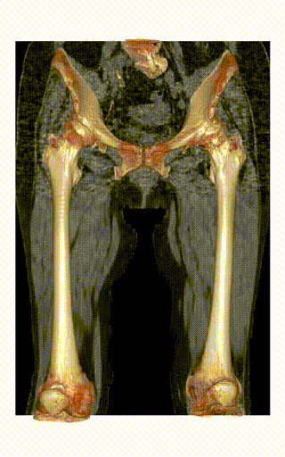

This is a VTK wrapper of volume renderer, including:
- [x] Volume rendering
- [x] Surface rendering
- [x] Surface distance rendering
- [x] Isosurface rendering


## Requirements
- Python 3
- VTK

## Installation
#### Clone this repository
```bash
git clone https://github.com/yuta-hi/volume-renderer
cd volume-renderer
```
#### Register the preset
You can register own preset files. See the `./pyvr/presets`

#### Install
```bash
pip install .
```

## Usage

### Console
```bash
volume_render --help
surface_render --help
surface_distance_render --help
isosurface_render --help
```

### Python
#### Volume rendering
```python
from pyvr import volume_render

volume = 'image.mhd'
preset = 'muscle' # ['bone', 'skelton', ...]

proj = volume_render(volume, preset)
```
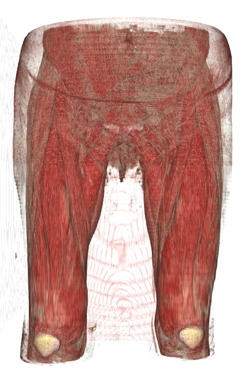 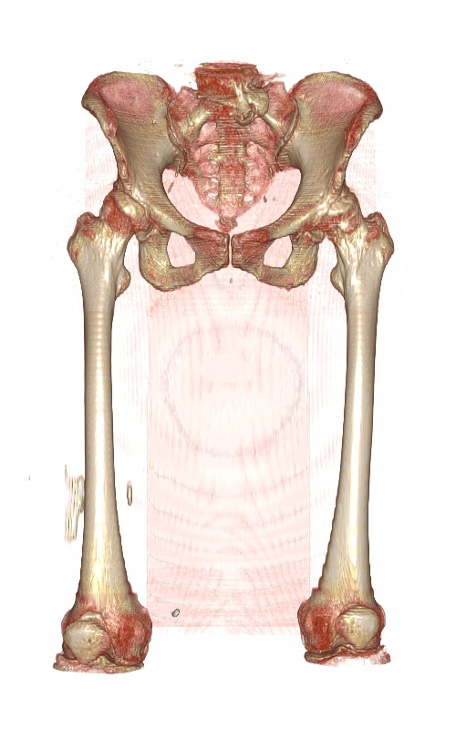 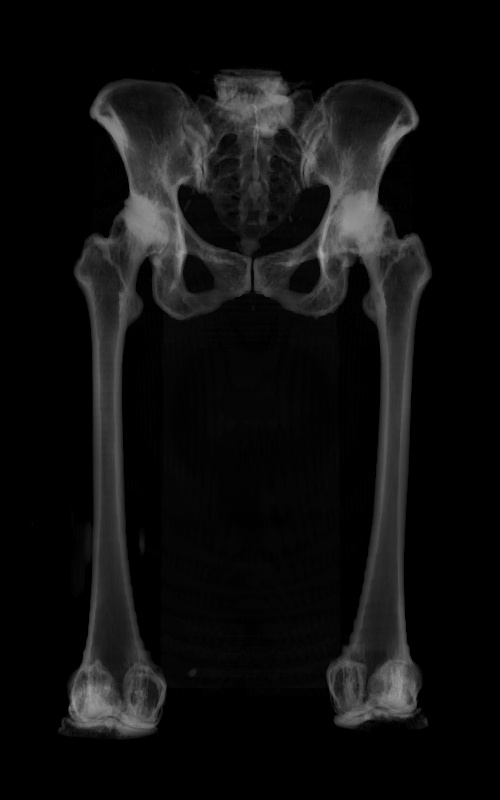

#### Surface rendering
```python
from pyvr import surface_render

volume = 'label.mhd'
preset = 'muscle' # ['bone', 'skin', 'hip_group1', ...]

proj = surface_render(volume, preset)
```
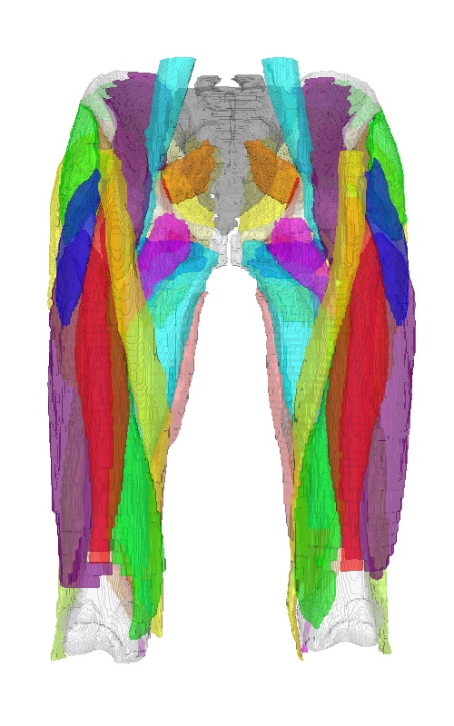 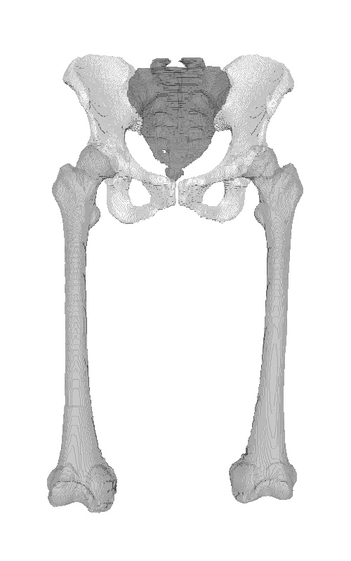 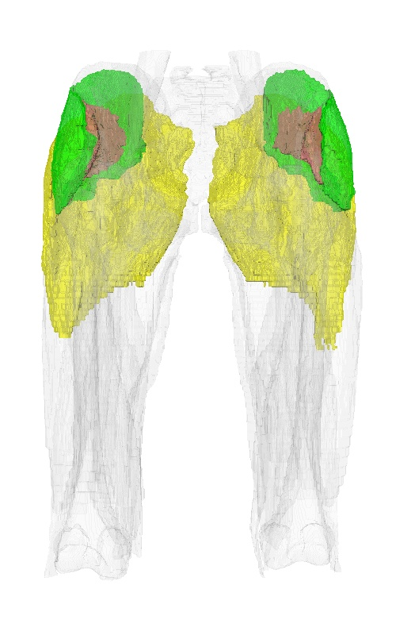


#### Surface distance rendering

```python
source = 'label_a.mhd'
target = 'label_b.mhd'

source_index = 1
target_index = 1

clim = (0, 10) # [mm]

proj = surface_distance_render(source, target, source_index, target_index, clim=clim)
```
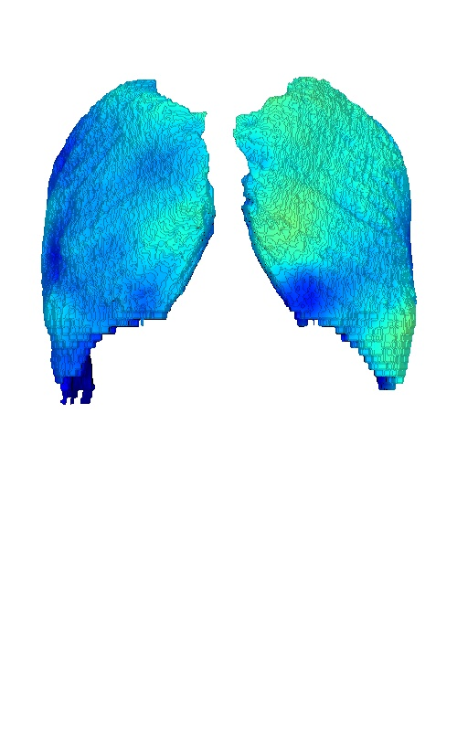

#### Isosurface rendering
```python
from pyvr import isosurface_render

volume = 'label.mhd'
index = 1
rgb = [0., 0., 1.]

proj = isosurface_render(volume, index, rgb=rgb)
```
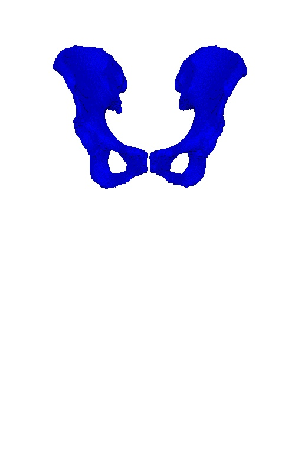

#### Customize
```python
from pyvr.renderer import Renderer
from pyvr.actors import IsosurfaceActor
from pyvr.actors import SurfaceDistanceActor

renderer = Renderer()
renderer.add_actor(IsosurfaceActor(source, index=1, rgb=[1.,1.,1.], alpha=0.3))
renderer.add_actor(IsosurfaceActor(source, index=2, rgb=[1.,1.,1.], alpha=0.3))
renderer.add_actor(IsosurfaceActor(source, index=22, rgb=[0.5,0.5,0.5], alpha=0.3))
renderer.add_actor(SurfaceDistanceActor(source, target, source_index, target_index, clim=clim))
proj = renderer.render(rotate_angles=rotate_angles, bg=bg)

return proj
```
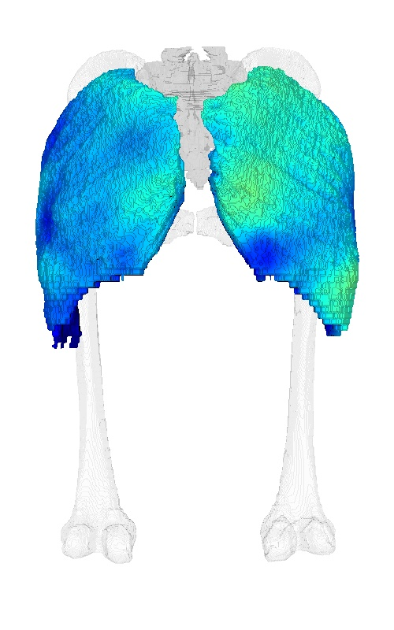

#### Slice
```python
from pyvr.renderer import Renderer
from pyvr.actors import VolumeActor
from pyvr.actors import SliceActor
from pyvr.data.volume import load_volume

volume = load_volume(volume_file)
clim = (-150, 350)

renderer = Renderer()
renderer.set_camera(pos=(0,-1000,0))
renderer.add_actor(VolumeActor(volume, 'bone'))
renderer.add_actor(SliceActor(volume, normal=(1,0,0), clim=clim))
renderer.add_actor(SliceActor(volume, normal=(0,1,0), clim=clim))
renderer.add_actor(SliceActor(volume, normal=(0,0,1), clim=clim))
proj = renderer.render(rotate_angles=rotate_angles, bg=bg)

return proj
```


#### Landmark
```python
from pyvr.renderer import Renderer
from pyvr.actors import VolumeActor
from pyvr.actors import LandmarkActor

renderer = Renderer()
renderer.set_camera(pos=(0,-1000,0))
renderer.add_actor(VolumeActor(volume, 'bone'))
renderer.add_actor(LandmarkActor((99.658,-53.036,-195.258), 10, rgb=(1,0,0)))
renderer.add_actor(LandmarkActor((-105.237,-57.957,-188.071), 10, rgb=(0,1,0)))
renderer.add_actor(LandmarkActor((0.753,-52.335,-105.167), 10, rgb=(0,0,1)))
proj = renderer.render(rotate_angles=rotate_angles, bg=bg)

return proj
```
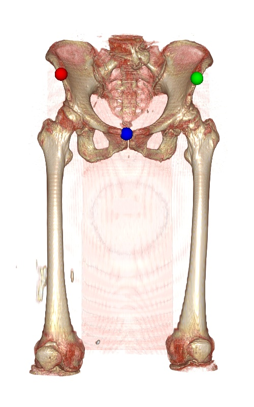


#### Write projections as video
```python
from pyvr.utils.video import write_video
write_video(proj, 'video.mp4')
```


#### Interactive rendering with multiple viewports
```python
from pyvr.renderer import InteractiveMultiViewRenderer
from pyvr.actors import VolumeActor
from pyvr.actors import SurfaceActor

renderer = InteractiveMultiViewRenderer()
renderer.set_camera(pos=(0,-1200,0))
renderer.add_actor(VolumeActor(volume, 'muscle'))
renderer.add_actor(SurfaceActor(label, 'muscle'))
renderer.add_actor(VolumeActor(uncertainty, 'uncertainty'))
renderer.render(bg=(1,1,1))
```


See also [Bayesian U-Net](https://github.com/yuta-hi/bayesian_unet) for uncertainty estimates.
